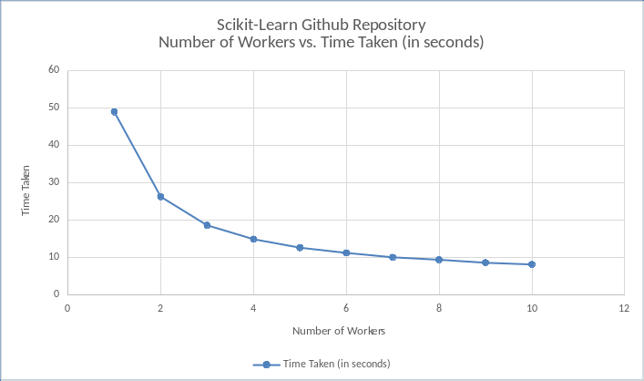
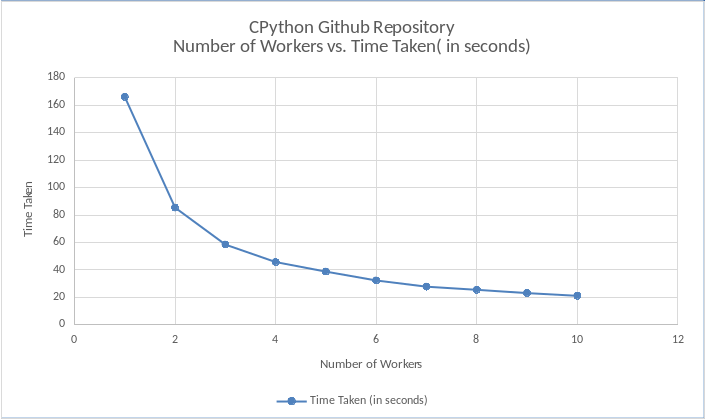

# CS7NS1 - Rest Service Development Task	

# Student ID: 17306521 

# Use of Cloud Haskell to calculate Size of each file for a Given Repository and observing Number of Workers vs. Time Taken (in seconds)

## Introduction

This project focuses on computation of size of each file for a given repository utilising a set of nodes/workers as appropriate to minimise execution time.

Note: This Repository is continuation of work from [CloudHaskell-Repo](https://github.com/AshwathSalimath/CloudHaskell-Repo) under my account. I have already sent invitation for CloudHaskell-Repo.

## Implementation

I used the [CloudHaskell](https://bitbucket.org/esjmb/use-cloudhaskell) libraries to distribute the work among worker nodes and to compute the size of each file in the given repository.

To obtain the repository’s working folder, I send a command to clone the repo into my own folder. I will then recursively go through through the folder and obtain the absolute file path for ALL files in the repo directory.

Once these are obtained I send these file paths to the workers to get the size of each file in a repo and return the results back to the manager.

## Compiling and Running the Project

1. Clone this repo using `git clone https://github.com/AshwathSalimath/CloudHaskell-FileSize` 
2. `stack build` inside the directory
3. `bash runworkers.sh` to create the workers (you can edit this file to add more or use less)
4. `bash run.sh <repo>`

## Results

The Code was executed on a local machine. The Code was executed on two repositories. The time between the manager sending the work to worker nodes and manager receiving the result from worker nodes was captured. This was used to build graph of Number of Workers vs. Time Taken (in seconds).

This project uses Work-Stealing pattern to distribute the task to worker nodes. 

We can infer from the following graphs that the Time Taken suddenly drops when we shift from Nodes 1 to 2. Then the time taken will not decrease that much as we were eventually expecting by making use of more workers/nodes to complete the task/work.

Graph also describes that the time taken is moving towards becoming a constant value. We can infer that increasing workers/nodes to complete the task/work will not matter that much. 

1. Results based on [Scikit-Learn Repository](https://github.com/scikit-learn/scikit-learn):

### Table

| Number of Workers | Time Taken (s) |
| ------------- | ------------- |
| 1 | 49.045018 |
| 2 | 26.336942 |
| 3 | 18.700856 |
| 4 | 14.982447 |
| 5 | 12.711739 |
| 6 | 11.308899 |
| 7 | 10.133967 |
| 8 | 9.472676 |
| 9 | 8.686901 |
| 10 | 8.215595 |

### Graph

2. Results based on [CPython Repository](https://github.com/python/cpython):

### Table

| Numbers of Workers | Time Taken (s) |
| ------------- | ------------- |
| 1 | 166.120229 |
| 2 | 85.422575 |
| 3 | 58.505862 |
| 4 | 45.780014 |
| 5 | 38.798251 |
| 6 | 32.376771 |
| 7 | 27.826886 |
| 8 | 25.544315 |
| 9 | 23.161615 |
| 10 | 21.176499 |

### Graph

